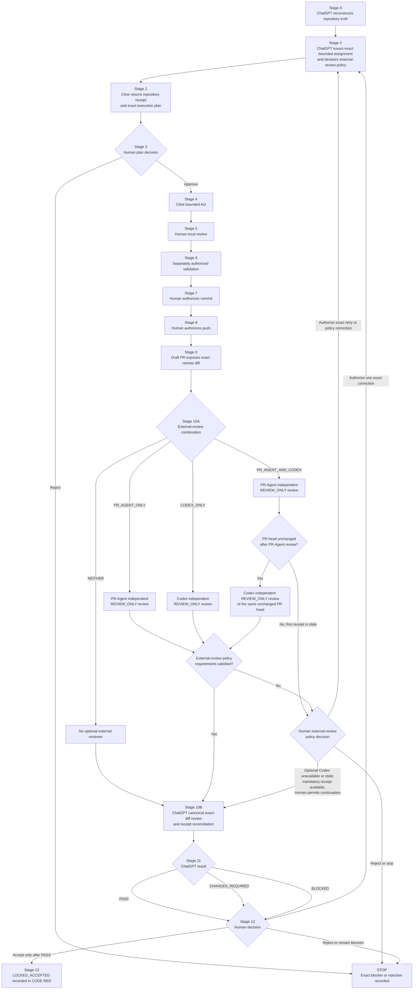

# Phase 2A Tri-AI Alignment and Recovery Plan

```yaml
plan_id: PHASE_2A_TRI_AI_ALIGNMENT_AND_RECOVERY_PLAN_001
document_status: CANONICAL_PROPOSED_GOVERNANCE_PLAN
publication_date: 2026-07-27
repository: ariessocia04-rgb/galax-Ai-project
plan_branch: plan/phase-2a-external-review-layer-2026-07-27
canonical_research_base: agent/agent-01-tool-inspection
implementation_branch: implementation/foundation-agent-01
active_implementation_PR: 7
plan_author: ChatGPT
plan_publication_authorized_by: Human_Owner
plan_publication_authorized: true
implementation_authorized_by_this_document: false
merge_authorized: false
deployment_authorized: false
```

## 1. Purpose

This is the complete governance plan for adding an optional external review layer to the existing Galax development workflow.

It integrates PR-Agent and/or Codex without changing the Galax CrewAI runtime, Foundation logic, Agent 01 execution contract, or Agents 02–15.

```text
ChatGPT defines architecture and one exact assignment
→ Cline is the sole primary local writer
→ Aider, mini-SWE-agent, or OpenHands may act only under separate narrow assignments
→ separately authorized validation
→ separately authorized commit
→ separately authorized push
→ Draft PR exposes the exact current remote diff
→ optional external review layer runs according to the Stage 1 policy
→ ChatGPT performs the required canonical exact-diff review
→ Human Owner makes the final decision
→ accepted work becomes LOCKED_ACCEPTED in CODE RED
```

## 2. Compatibility baseline

This plan must remain compatible with:

```text
AGENTS.md
→ docs/plan/FOUNDATION_AGENT01_FLOW_EXECUTION_CONTRACT_2026-07-21.md
→ docs/research/crewai/CREWAI_1_15_4_FULL_AGENT_REMEDIATION_BLUEPRINT_2026-07-20.md
→ docs/plan/CHATGPT_CLINE_DRAFT_PR_EXECUTION_CONTROL_PLAN_2026-07-22.md
→ docs/plan/EXTERNAL_AI_CONTRIBUTOR_EXECUTION_PLAN_DRAFT.md
```

The following runtime decisions are preserved and are not modified by this plan:

```yaml
CrewAI_process: sequential
CrewAI_native_planning: false
CrewAI_native_reasoning: false
CrewAI_native_memory: false
allow_delegation: false
allow_code_execution: false
async_execution: false
parallel_agents: false
parallel_tool_calls: false

RepositoryPreflightTool_owner: GalaxFoundationFlow
RepositoryPreflightTool_invoked_before_Agent_01: true
RepositoryPreflightTool_calls_per_run: 1
engineering_manager_tools: []
Agent_01_direct_tool_calls: 0
Agent_01_LLM_calls: 1
Agent_01_output: AgentTaskResult
result_as_answer_for_Agent_01_path: prohibited
hidden_second_agent_call: prohibited
HumanReviewRequest_builder: pure_Python_Pydantic
explicit_router_for_every_branch: required
blocked_route_reaches_success: prohibited
LLM_profiles_enabled: false
Agents_02_to_15_enabled: false
```

The only permitted change to the Foundation execution contract is a narrow documentation alignment inside:

```text
Section 11 — External contributor boundary
```

No runtime section, router, model, tool, permission, test contract, or Agent 01 invariant may change.

## 3. Repository evidence at plan publication

```yaml
local_observed_state:
  branch: implementation/foundation-agent-01
  head_sha: 0f02475df29b567253131f53c8fa5b162c12ec94
  tracked_changes: []
  untracked_paths:
    - .clinerules/workflows/
    - .vscode/
    - research/
    - src/galax/__pycache__/
    - src/galax/foundation/__pycache__/

remote_observed_state:
  Draft_PR: 7
  Draft_PR_state: open_draft
  head_branch: implementation/foundation-agent-01
  current_remote_head_sha: f41f53beffabd5f9ac1f83920e0141f5925cedbb
  commits: 2
  changed_files: 6
  PR_body_recorded_head_sha: 0f02475df29b567253131f53c8fa5b162c12ec94
  PR_body_is_stale: true

classification:
  local_remote_relationship: LOCAL_BEHIND_REMOTE_BY_ONE_KNOWN_COMMIT
  local_state_current_for_remote_review: false
  Phase_2A_commit_0f02475_unpushed: false
  current_PR_review_classification: UNREVIEWED_AFTER_ADDITIONAL_COMMIT
```

This plan branch is separate from `implementation/foundation-agent-01` and Draft PR #7. It must not reset, rebase, merge, force-update, or otherwise mutate that implementation branch or PR.

## 4. Authority and roles

```yaml
Human_Owner:
  final_authority: true
  scope_authority: true
  Act_mode_authority: true
  commit_authority: true
  push_authority: true
  architecture_acceptance: true
  PR_approval_authority: true
  merge_authority: true
  deployment_authority: true

ChatGPT:
  roles:
    - repository_aware_architect
    - exact_assignment_author
    - fact_checker
    - canonical_exact_diff_reviewer
    - external_review_receipt_reconciler
  local_implementation_writer: false
  canonical_review_authority: true
  final_acceptance_authority: false

Cline:
  role: SOLE_PRIMARY_LOCAL_WRITER
  planning_authority_for_this_design: false
  redesign_authority: false
  exact_bounded_execution_only: true
  automatic_continuation: prohibited

PR_Agent:
  contributor_class: EXTERNAL_DEVELOPMENT_CONTRIBUTOR
  role: OPTIONAL_READ_ONLY_STABLE_PR_REVIEWER
  mode: REVIEW_ONLY
  automatic_trigger: prohibited
  automatic_feedback: disabled
  write_authority: false
  approval_authority: false
  canonical_review_authority: false
  final_acceptance_authority: false
  merge_authority: false

Codex:
  contributor_class: EXTERNAL_DEVELOPMENT_CONTRIBUTOR
  role: INDEPENDENT_ADVISORY_REMOTE_REVIEWER
  mode: REVIEW_ONLY
  exact_model: recorded_at_authorized_review_trigger
  automatic_trigger: prohibited
  write_authority: false
  canonical_review_authority: false
  final_acceptance_authority: false
  direct_Cline_control: prohibited
  direct_ChatGPT_control: prohibited
  custom_bridge: deferred
  custom_MCP_bridge: prohibited_now

shared_coordination:
  canonical_source_of_truth: GitHub
  review_surface: Draft_Pull_Request
  automatic_AI_to_AI_connection: false
  direct_AI_to_AI_control: prohibited
  simultaneous_writers: prohibited
```

## 5. Scope and applicability

```yaml
policy_applicability:
  current_scope:
    - Governance_Foundation
    - Agent_01

  effective_for:
    - new_GALAX_AI_ASSIGNMENT_V1_records_created_after_Human_Owner_acceptance_of_this_plan

  historical_assignments_retroactively_invalidated: false

  historical_assignments:
    treatment:
      - remain_evidence_of_their_original_authorized_scope
      - do_not_gain_new_permissions
      - do_not_become_invalid_only_because_the_external_review_field_did_not_exist

  Agents_02_to_15:
    status: prohibited_until_separately_researched_implemented_tested_and_approved
```

This plan does not authorize any Agent 02–15 implementation, reviewer policy, runtime activation, tool access, LLM profile, or deployment.

## 6. Non-goals and prohibitions

```yaml
not_authorized:
  - automatic_ChatGPT_to_Codex_trigger
  - automatic_Codex_to_Cline_trigger
  - automatic_PR_Agent_trigger
  - generic_agent_mesh
  - custom_MCP_bridge
  - Codex_write_mode
  - PR_Agent_write_mode
  - mandatory_global_Codex_PASS
  - replacement_of_ChatGPT_canonical_review
  - replacement_of_Human_Owner_final_authority
  - change_to_Foundation_or_Agent_01_runtime
  - change_to_Agents_02_to_15
  - Stage_10C
  - alternative_A_to_J_workflow
  - direct_write_to_main
  - force_push
  - automatic_merge
  - deployment
```

## 7. Unified external-review policy

Every new in-scope Stage 1 `GALAX_AI_ASSIGNMENT_V1` created after Human Owner acceptance must declare one exact combination and one exact Codex receipt policy.

```yaml
external_review_policy:
  combination:
    allowed_values:
      - NEITHER
      - PR_AGENT_ONLY
      - CODEX_ONLY
      - PR_AGENT_AND_CODEX

  Codex_receipt_policy:
    allowed_values:
      - NOT_USED
      - ADVISORY_OPTIONAL
      - ADVISORY_REQUIRED_RECEIPT
```

### 7.1 Validation

```yaml
external_review_policy_validation:
  NEITHER:
    Codex_receipt_policy_must_be: NOT_USED
    PR_Agent_receipt_required: false

  PR_AGENT_ONLY:
    Codex_receipt_policy_must_be: NOT_USED
    PR_Agent_receipt_required: true

  CODEX_ONLY:
    Codex_receipt_policy_allowed:
      - ADVISORY_OPTIONAL
      - ADVISORY_REQUIRED_RECEIPT
    PR_Agent_receipt_required: false

  PR_AGENT_AND_CODEX:
    Codex_receipt_policy_allowed:
      - ADVISORY_OPTIONAL
      - ADVISORY_REQUIRED_RECEIPT
    PR_Agent_receipt_required: true

invalid_or_missing_policy:
  status: BLOCKED_POLICY_VALIDATION_CONFLICT
  continue_to_Stage_10B: false
```

### 7.2 Both-reviewer execution contract

When both reviewers are selected, they run sequentially, never in parallel:

```yaml
when_PR_Agent_and_Codex_are_both_used:
  execution_mode: SEQUENTIAL_READ_ONLY
  execution_order:
    - PR_Agent
    - Codex

  parallel_execution: prohibited
  same_current_PR_head_required: true
  independent_reviews_required: true

  receipt_isolation:
    PR_Agent_may_not_read_Codex_receipt_before_completion: true
    Codex_may_not_read_PR_Agent_receipt_before_completion: true

  head_change_between_reviews:
    first_receipt_becomes_stale: true
    continue_to_second_review: false
    next_action: HUMAN_EXTERNAL_REVIEW_POLICY_DECISION

  ChatGPT_reconciles_after_required_reviews_complete: true
  neither_receipt_replaces_ChatGPT_review: true
  neither_reviewer_has_final_authority: true
```

### 7.3 Current-head and stale rules

```yaml
review_head_rule:
  current_PR_head_sha_required: true
  PR_Agent_reviewed_head_sha_required_when_used: true
  Codex_reviewed_head_sha_required_when_used: true
  ChatGPT_reviewed_head_sha_required: true
  all_used_reviews_must_reference_same_current_head: true
  review_becomes_stale_when_head_changes: true

receipt_stale_rule:
  stale_when: reviewed_head_sha_does_not_equal_current_PR_head_sha
  stale_receipt_may_not_satisfy_required_receipt_gate: true
```

```yaml
stale_review_actions:
  PR_AGENT_ONLY:
    action:
      - require_new_current_head_PR_Agent_receipt
      - otherwise_BLOCK_FOR_HUMAN_DECISION

  CODEX_ONLY:
    ADVISORY_OPTIONAL:
      action:
        - Human_Owner_may_retrigger_Codex
        - or_record_stale_or_unavailable_Codex_receipt_and_allow_ChatGPT_review
    ADVISORY_REQUIRED_RECEIPT:
      action:
        - require_new_current_head_Codex_receipt
        - otherwise_BLOCK_FOR_HUMAN_DECISION

  PR_AGENT_AND_CODEX:
    ADVISORY_OPTIONAL:
      PR_Agent_action:
        - require_new_current_head_PR_Agent_receipt
      Codex_action:
        - Human_Owner_may_retrigger_Codex
        - or_record_stale_or_unavailable_Codex_receipt_and_allow_ChatGPT_review
    ADVISORY_REQUIRED_RECEIPT:
      action:
        - require_new_current_head_PR_Agent_receipt
        - require_new_current_head_Codex_receipt
        - otherwise_BLOCK_FOR_HUMAN_DECISION
```

### 7.4 Receipt relay

```yaml
receipt_relay:
  automatic_AI_to_AI_relay: prohibited
  allowed_methods:
    - Human_Owner_relays_receipt
    - Human_Owner_posts_receipt_to_Issue_2
    - separately_authorized_publication_to_Issue_2
    - separately_authorized_PR_review_publication
  PR_Agent_may_not_trigger_Cline: true
  Codex_may_not_trigger_Cline: true
  Codex_may_not_apply_corrections: true
  ChatGPT_must_verify_receipt_evidence: true
```

## 8. Stage 1 assignment extension

Add after `mode` for new in-scope assignments:

```yaml
external_review_policy:
  combination: NEITHER | PR_AGENT_ONLY | CODEX_ONLY | PR_AGENT_AND_CODEX
  Codex_receipt_policy: NOT_USED | ADVISORY_OPTIONAL | ADVISORY_REQUIRED_RECEIPT
```

Add these stop conditions:

```yaml
stop_conditions:
  - external_review_policy_missing_for_new_in_scope_assignment
  - external_review_policy_invalid
  - selected_external_reviewer_not_authorized
  - selected_external_reviewer_head_mismatch
  - required_external_review_receipt_missing
  - required_external_review_receipt_stale
```

A missing field in a historical pre-acceptance assignment is not, by itself, a blocker.

## 9. Canonical Stage 0–13 workflow

Stage 0–9 remain unchanged. Replace only the existing Stage 10 line with Stage 10A and Stage 10B. Preserve Stage 11–13 verbatim.

```text
STAGE 0 — ChatGPT reconstructs repository truth through CODE RED
STAGE 1 — ChatGPT issues one exact bounded assignment
STAGE 2 — Cline returns REPOSITORY_READ_RECEIPT and plan
STAGE 3 — Human accepts or rejects the plan
STAGE 4 — Cline performs only the bounded Act work
STAGE 5 — Human reviews the proposed local action
STAGE 6 — Cline runs only separately authorized validation commands
STAGE 7 — Human authorizes a coherent local commit
STAGE 8 — Human separately authorizes push to the implementation branch
STAGE 9 — Draft PR updates with the exact remote diff
STAGE 10A — OPTIONAL EXTERNAL REVIEW LAYER
STAGE 10B — CHATGPT CANONICAL EXACT-DIFF REVIEW
STAGE 11 — ChatGPT returns PASS, CHANGES_REQUIRED, or BLOCKED
STAGE 12 — Human accepts the stage or authorizes one exact correction
STAGE 13 — Accepted files and stage are recorded as LOCKED_ACCEPTED in CODE RED
```

### 9.1 Stage 10A

The Stage 1 policy selects exactly one combination.

Every selected reviewer:

- operates in `REVIEW_ONLY`;
- reviews the exact current Draft PR head SHA;
- returns an independent receipt;
- performs no edit, fix, commit, push, approval, label, merge, deployment, or workflow mutation;
- does not replace ChatGPT;
- does not make the final decision.

For `PR_AGENT_AND_CODEX`, PR-Agent completes first. The current PR head is rechecked. Codex runs second only when the head is unchanged.

### 9.2 Stage 10B

ChatGPT independently reviews the exact current Draft PR diff and repository authority.

ChatGPT verifies and reconciles any current-head PR-Agent and Codex receipts, but remains the canonical reviewer.

## 10. Review receipt schemas

### 10.1 PR-Agent

```yaml
GALAX_PR_AGENT_REVIEW_RECEIPT_V1:
  assignment_id:
  repository:
  PR_number:
  base_branch:
  base_sha:
  head_branch:
  current_PR_head_sha:
  reviewed_head_sha:
  mode: REVIEW_ONLY
  files_reviewed: []
  plan_alignment: PASS | FAIL | BLOCKED
  architecture_compatibility: PASS | FAIL | BLOCKED
  test_evidence_assessment: PASS | FAIL | BLOCKED | NOT_APPLICABLE
  security_assessment: PASS | FAIL | BLOCKED
  regressions: []
  unauthorized_changes: []
  unsupported_claims: []
  blockers: []
  exact_advisory_findings: []
  status: PASS_FOR_HUMAN_REVIEW | CHANGES_REQUIRED | BLOCKED_EVIDENCE_MISSING
  authoritative: false
  mutations_performed: false
  next_action: RETURN_TO_HUMAN_OWNER
```

### 10.2 Codex

```yaml
GALAX_CODEX_REVIEW_RECEIPT_V1:
  assignment_id:
  repository:
  PR_number:
  base_branch:
  base_sha:
  head_branch:
  current_PR_head_sha:
  reviewed_head_sha:
  mode: REVIEW_ONLY
  Codex_receipt_policy: ADVISORY_OPTIONAL | ADVISORY_REQUIRED_RECEIPT
  exact_model:
  files_reviewed: []
  plan_alignment: PASS | FAIL | BLOCKED
  CrewAI_compatibility: PASS | FAIL | BLOCKED
  architecture_compatibility: PASS | FAIL | BLOCKED
  test_evidence_assessment: PASS | FAIL | BLOCKED | NOT_APPLICABLE
  security_assessment: PASS | FAIL | BLOCKED
  regressions: []
  unauthorized_changes: []
  unsupported_claims: []
  blockers: []
  exact_advisory_findings: []
  status: ADVISORY_PASS | ADVISORY_CHANGES_SUGGESTED | ADVISORY_BLOCKER_FLAGGED
  authoritative: false
  mutations_performed: false
  next_action: RETURN_TO_HUMAN_OWNER
```

No Codex receipt exists when the policy is `NOT_USED`.

## 11. ChatGPT reconciliation

```yaml
external_review_reconciliation:
  external_review_combination: NEITHER | PR_AGENT_ONLY | CODEX_ONLY | PR_AGENT_AND_CODEX
  Codex_receipt_policy: NOT_USED | ADVISORY_OPTIONAL | ADVISORY_REQUIRED_RECEIPT
  current_PR_head_sha:

  PR_Agent:
    selected:
    receipt_available:
    receipt_reviewed_head_sha:
    receipt_matches_current_PR_head:
    confirmed_findings: []
    rejected_findings_with_reasons: []
    not_verifiable_findings: []
    not_applicable_findings: []

  Codex:
    selected:
    receipt_available:
    receipt_reviewed_head_sha:
    receipt_matches_current_PR_head:
    unavailability_recorded:
    Human_Owner_allows_optional_continuation:
    confirmed_findings: []
    rejected_findings_with_reasons: []
    not_verifiable_findings: []
    not_applicable_findings: []

  reviewer_disagreements: []
  external_review_policy_requirements_satisfied:
  ChatGPT_canonical_result: PASS | CHANGES_REQUIRED | BLOCKED
```

External reviewer findings have no independent canonical authority. A finding affects the canonical result only when ChatGPT independently confirms it or the Human Owner rejects the associated risk.

## 12. Definition of done

```yaml
definition_of_done:
  local_change_complete: true
  required_tests_satisfied: true
  commit_authorized_by_Human_Owner: true
  push_authorized_by_Human_Owner: true
  exact_Draft_PR_diff_available: true
  external_review_policy_requirements_satisfied: true
  ChatGPT_final_review:
    status: PASS
    reviewed_head_matches_current_PR_head: true
  Human_Owner_acceptance: true
  CODE_RED_acceptance_recorded: true
  LOCKED_ACCEPTED_recorded: true
```

```yaml
external_review_policy_requirements:
  NEITHER:
    satisfied_when:
      - no_external_receipt_required

  PR_AGENT_ONLY:
    satisfied_when:
      - current_head_PR_Agent_receipt_available

  CODEX_ONLY:
    ADVISORY_OPTIONAL:
      satisfied_when:
        any_of:
          - current_head_Codex_receipt_available
          - Codex_unavailability_recorded_and_Human_Owner_allows_ChatGPT_review
    ADVISORY_REQUIRED_RECEIPT:
      satisfied_when:
        - current_head_Codex_receipt_available

  PR_AGENT_AND_CODEX:
    ADVISORY_OPTIONAL:
      satisfied_when:
        all_of:
          - current_head_PR_Agent_receipt_available
          - any_of:
              - current_head_Codex_receipt_available
              - Codex_unavailability_recorded_and_Human_Owner_allows_ChatGPT_review
    ADVISORY_REQUIRED_RECEIPT:
      satisfied_when:
        all_of:
          - current_head_PR_Agent_receipt_available
          - current_head_Codex_receipt_available
```

Codex `PASS` is never a permanent acceptance requirement.

## 13. Exact repository changes

```yaml
allowed_paths:
  - AGENTS.md
  - README.md
  - docs/operations/CODE_RED.md
  - docs/plan/CHATGPT_CLINE_DRAFT_PR_EXECUTION_CONTROL_PLAN_2026-07-22.md
  - docs/plan/EXTERNAL_AI_CONTRIBUTOR_EXECUTION_PLAN_DRAFT.md
  - docs/plan/FOUNDATION_AGENT01_FLOW_EXECUTION_CONTRACT_2026-07-21.md
  - docs/prompts/EXTERNAL_AI_CONTRIBUTOR_COMMAND_PACK.md

explicit_no_change:
  - docs/research/crewai/CREWAI_1_15_4_FULL_AGENT_REMEDIATION_BLUEPRINT_2026-07-20.md
  - src/**
  - tests/**
  - pyproject.toml
  - uv.lock
  - .github/**
```

Maximum changed files: `7`.

### 13.1 AGENTS.md

Replace the contributor sequence with:

```text
Cline performs the exact bounded primary implementation
→ Aider, mini-SWE-agent, or OpenHands may act only when separately assigned
  for their existing narrow repair, comparison, or reproduction roles
→ optional external review layer executes according to the exact Stage 1 policy
→ ChatGPT performs the required canonical exact Draft PR diff review
→ Human Owner makes the final decision
```

Add the role block from Section 4 and policy summary from Sections 5 and 7.

Do not duplicate or replace the existing:

```yaml
custom_bridge: deferred
custom_MCP_bridge: prohibited_now
```

### 13.2 Foundation Agent 01 Flow execution contract

Modify only `Section 11 — External contributor boundary`.

Replace its contributor sequence with:

```text
Cline primary implementation
→ Aider one exact repair when separately assigned
→ mini-SWE-agent isolated comparison when separately assigned
→ OpenHands isolated fallback reproduction when separately assigned
→ optional external review layer according to the exact Stage 1 policy:
    - NEITHER
    - PR_AGENT_ONLY
    - CODEX_ONLY
    - PR_AGENT_AND_CODEX
→ when both are selected: PR-Agent REVIEW_ONLY, verify unchanged head,
  then Codex REVIEW_ONLY
→ ChatGPT canonical exact-diff review
→ Human Owner decision
```

Add:

```yaml
external_review_alignment:
  scope:
    - Governance_Foundation
    - Agent_01
  PR_Agent_optional: true
  Codex_optional: true
  both_reviewers_execution: SEQUENTIAL_READ_ONLY
  parallel_external_reviews: prohibited
  same_current_PR_head_required: true
  ChatGPT_canonical_review_required: true
  Human_Owner_final_authority: true
  runtime_architecture_changed: false
```

Do not modify Sections 1–10 or Section 12. Do not change any Agent 01 invariant.

### 13.3 ChatGPT+Cline control plan

In `GALAX_AI_ASSIGNMENT_V1`, add the Section 8 fields and stop conditions for new in-scope assignments.

Replace only the existing Stage 10 line with:

```text
STAGE 10A — OPTIONAL EXTERNAL REVIEW LAYER
STAGE 10B — CHATGPT CANONICAL EXACT-DIFF REVIEW
```

Preserve Stage 11–13 verbatim.

Immediately after Stage 13, add a section containing the complete role, scope, policy, sequential review, receipt, reconciliation, done, and Mermaid rules from this plan.

### 13.4 External contributor execution plan

Preserve the existing Cline, Aider, mini-SWE-agent, OpenHands, and PR-Agent role boundaries.

Add Codex as an optional human-authorized `REVIEW_ONLY` reviewer.

Replace the old review tail with:

```text
After the Human Owner selects or rejects any external patches:

→ canonical Stage 9 exposes the exact Draft PR diff
→ canonical Stage 10A runs the exact optional external-review combination
→ for PR_AGENT_AND_CODEX: PR-Agent completes first, the head is verified
  unchanged, then Codex reviews the same current head
→ canonical Stage 10B runs ChatGPT canonical exact-diff review
→ canonical Stage 11 records PASS, CHANGES_REQUIRED, or BLOCKED
→ canonical Stage 12 records the Human Owner decision
→ canonical Stage 13 records LOCKED_ACCEPTED after every gate passes
```

Do not create a mandatory reviewer, Stage 10C, or parallel review.

### 13.5 External contributor command pack

Preserve the pinned PR-Agent command and security boundaries.

Replace the short PR-Agent output with `GALAX_PR_AGENT_REVIEW_RECEIPT_V1`.

Add an unnumbered Codex section before the existing numbered Section 8. Do not renumber existing sections.

The Codex section must include:

- `INDEPENDENT_ADVISORY_REMOTE_REVIEWER`;
- `REVIEW_ONLY`;
- valid policy mappings;
- `GALAX_CODEX_REVIEW_RECEIPT_V1`;
- same-current-head rules;
- no edits, commits, pushes, approval, labels, merge, deployment, secret access, Cline trigger, or canonical authority.

### 13.6 README.md

Replace the development-control workflow with:

```text
ChatGPT issues one exact bounded assignment
→ Cline works locally with manual approvals and checkpoints
→ exact tests
→ separately authorized commit
→ separately authorized push
→ Draft PR exposes the exact diff
→ optional external review layer according to the Stage 1 policy
→ when both reviewers are selected: PR-Agent then Codex sequentially
  against the same unchanged current PR head
→ ChatGPT canonical exact-diff review and receipt reconciliation
→ ChatGPT returns PASS, CHANGES_REQUIRED, or BLOCKED
→ Human Owner accepts, authorizes one exact correction, or rejects
→ accepted work is recorded as LOCKED_ACCEPTED in CODE RED
```

### 13.7 CODE_RED.md

Append a bounded governance decision without changing the operational Phase 2A implementation stage:

```yaml
CODE_RED_EXTERNAL_REVIEW_POLICY_DECISION:
  classification: HUMAN_OWNER_APPROVED_GOVERNANCE_PLAN
  plan_id: PHASE_2A_TRI_AI_ALIGNMENT_AND_RECOVERY_PLAN_001
  operational_Phase_2A_stage_changed: false
  runtime_architecture_changed: false
  Foundation_contract_change_scope: Section_11_external_contributor_boundary_only

  policy_applicability:
    current_scope:
      - Governance_Foundation
      - Agent_01
    historical_assignments_retroactively_invalidated: false
    Agents_02_to_15_enabled: false

  external_review_layer:
    PR_Agent_optional: true
    Codex_optional: true
    both_reviewers_execution: SEQUENTIAL_READ_ONLY
    parallel_external_reviews: prohibited
    ChatGPT_canonical_review_required: true
    Human_Owner_final_authority: true

  automatic_reviewer_trigger_enabled: false
  custom_bridge_status: deferred
  custom_MCP_bridge_status: prohibited_now

  plan_publication_performed: true
  governance_implementation_performed: false
  implementation_file_mutation_performed: false
  Cline_commit_performed: false
  Cline_push_performed: false
  PR_Agent_triggered: false
  Codex_triggered: false
```

Update factual fields only after the corresponding events occur.

## 14. Canonical Mermaid flow

````text

````

## 15. Execution ownership

```yaml
plan_architecture:
  owner: ChatGPT
  status: COMPLETE_IN_THIS_DOCUMENT

plan_publication:
  owner: ChatGPT
  status: PUBLISHED_TO_DRAFT_PR_8

Human_Owner_plan_acceptance:
  status: REQUIRED_BEFORE_CLINE_EXECUTION

Cline_governance_edits:
  mode: ACT_BOUNDED
  status: PREPARED_NOT_AUTHORIZED

validation:
  owner: Cline
  status: REQUIRES_SEPARATE_AUTHORIZATION

commit:
  owner: Cline
  status: REQUIRES_SEPARATE_HUMAN_AUTHORIZATION

push:
  owner: Cline
  status: REQUIRES_SEPARATE_HUMAN_AUTHORIZATION

optional_PR_Agent_review:
  mode: REVIEW_ONLY
  status: NOT_SELECTED

optional_Codex_review:
  mode: REVIEW_ONLY
  status: NOT_SELECTED

ChatGPT_canonical_review:
  status: REQUIRED_AFTER_CURRENT_DRAFT_PR_DIFF_EXISTS

Human_Owner_final_acceptance:
  status: REQUIRED
```

## 16. Cline execution contract

Cline must execute this plan, not redesign it.

```yaml
CLINE_EXECUTION_READINESS_RECEIPT_V1:
  plan_id: PHASE_2A_TRI_AI_ALIGNMENT_AND_RECOVERY_PLAN_001
  repository:
  branch:
  head_sha:
  dedicated_worktree:
  files_read: []
  allowed_paths_verified:
  prohibited_paths_verified:
  Foundation_contract_Section_11_boundary_verified:
  exact_fragments_located:
  unresolved_placeholders_found: []
  conflicts_with_current_files: []
  proposed_commands: []
  proposed_tests: []
  redesign_performed: false
  safe_for_exact_Act: true_or_false
  blocker:
```

Cline must stop with:

- `BLOCKED_REPOSITORY_STATE_MISMATCH` for branch or HEAD mismatch;
- `BLOCKED_PLAN_FRAGMENT_CONFLICT` when a literal fragment cannot be applied;
- `BLOCKED_SCOPE_EXPANSION_REQUIRED` when any change outside the seven files or Foundation Section 11 is required.

Cline must not silently invent a replacement.

## 17. Required validation after Cline edits

```yaml
documentation_validation:
  - verify_exactly_seven_or_fewer_allowed_files_changed
  - verify_no_source_test_dependency_or_workflow_file_changed
  - verify_Foundation_contract_only_Section_11_changed
  - verify_all_Agent_01_runtime_invariants_unchanged
  - verify_policy_scope_is_Foundation_and_Agent_01_only
  - verify_historical_assignments_not_retroactively_invalidated
  - verify_PR_Agent_then_Codex_is_sequential_when_both_selected
  - verify_parallel_external_review_is_prohibited
  - verify_same_current_PR_head_required
  - verify_no_duplicate_Stage_10_definition
  - verify_Stage_11_12_13_canonical_lines_preserved
  - verify_custom_bridge_is_deferred
  - verify_custom_MCP_bridge_is_prohibited_now
  - verify_no_Stage_10C
  - verify_no_A_to_J_workflow
  - verify_no_S13LOCK
  - verify_Mermaid_parses
  - verify_no_unresolved_placeholder
  - verify_no_broken_section_reference
  - verify_policy_mapping
  - verify_Codex_receipt_does_not_allow_NOT_USED
  - verify_all_Stage_11_results_route_to_Stage_12
  - verify_rejection_and_blocked_routes_stop_or_require_human_action
```

```yaml
required_evidence:
  - git_status_short
  - git_diff_check
  - git_diff_stat
  - exact_changed_file_list
  - per_file_diff_summary
  - Foundation_contract_section_diff
  - Agent_01_invariant_comparison
  - Mermaid_validation_result
  - placeholder_search_result
  - policy_mapping_validation_result
  - canonical_stage_line_validation_result
```

## 18. Stop conditions

```yaml
stop_conditions:
  - repository_mismatch
  - branch_mismatch
  - head_mismatch
  - current_plan_file_missing
  - allowed_path_missing
  - unlisted_path_requires_change
  - Foundation_contract_section_outside_11_requires_change
  - Agent_01_runtime_invariant_would_change
  - accepted_artifact_unlock_required
  - conflicting_higher_authority_rule
  - duplicate_Stage_10_required
  - invalid_external_review_policy
  - parallel_external_review_required
  - Mermaid_parse_failure
  - unresolved_placeholder
  - validation_failure
  - another_writer_active_in_same_worktree
  - commit_not_separately_authorized
  - push_not_separately_authorized
```

No blocked route may continue to a successful stage.

## 19. Plan status

```yaml
plan_complete: true
compatibility_with_original_CrewAI_remediation: true
compatibility_with_Foundation_Agent_01_runtime: true
Foundation_contract_alignment_defined: true
role_boundaries_complete: true
policy_scope_complete: true
sequential_dual_review_complete: true
external_review_policy_complete: true
assignment_schema_extension_complete: true
receipt_schemas_complete: true
ChatGPT_reconciliation_complete: true
target_file_changes_complete: true
Mermaid_complete: true
validation_contract_complete: true
Cline_redesign_required: false

current_status: READY_FOR_HUMAN_PLAN_REVIEW
next_owner: Human_Owner
next_action: accept_or_reject_this_corrected_plan_before_Cline_ACT_BOUNDED_execution
```
