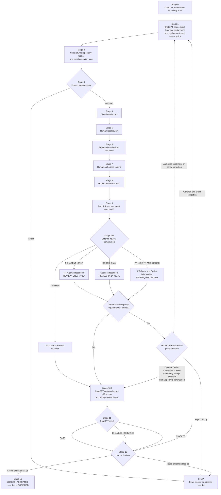

# Phase 2A Tri-AI Alignment and Recovery Plan

```yaml
plan_id: PHASE_2A_TRI_AI_ALIGNMENT_AND_RECOVERY_PLAN_001
document_status: CANONICAL_PROPOSED_GOVERNANCE_PLAN
publication_date: 2026-07-27
repository: ariessocia04-rgb/galax-Ai-project
plan_branch: plan/phase-2a-external-review-layer-2026-07-27
canonical_research_base: agent/agent-01-tool-inspection
implementation_branch: implementation/foundation-agent-01
active_implementation_PR: 7
plan_author: ChatGPT
plan_publication_authorized_by: Human_Owner
plan_publication_authorized: true
implementation_authorized_by_this_document: false
merge_authorized: false
deployment_authorized: false
```

## 1. Purpose

This document is the complete repository plan for integrating an optional external review layer composed of PR-Agent and/or Codex into the existing ChatGPT + Cline + Draft PR governance workflow.

It does not create an automatic AI-to-AI bridge. It does not make Codex or PR-Agent a writer. It does not replace ChatGPT as the canonical exact-diff reviewer. It does not change the Galax CrewAI runtime architecture or Agents 01–15.

The exact intended workflow is:

```text
ChatGPT defines the architecture and exact assignment
→ Cline is the sole primary local writer
→ optional narrow repair/comparison/reproduction contributors run only when separately assigned
→ exact tests
→ separate human commit authorization
→ separate human push authorization
→ Draft PR exposes the exact remote diff
→ optional external review layer runs according to the Stage 1 assignment policy
→ ChatGPT performs the canonical exact-diff review and reconciles any external receipts
→ Human Owner makes the final decision
→ accepted work becomes LOCKED_ACCEPTED and is recorded in CODE RED
```

## 2. Repository evidence at plan publication

```yaml
local_observed_state:
  branch: implementation/foundation-agent-01
  head_sha: 0f02475df29b567253131f53c8fa5b162c12ec94
  tracked_changes: []
  untracked_paths:
    - .clinerules/workflows/
    - .vscode/
    - research/
    - src/galax/__pycache__/
    - src/galax/foundation/__pycache__/

remote_observed_state:
  Draft_PR: 7
  Draft_PR_state: open_draft
  head_branch: implementation/foundation-agent-01
  current_remote_head_sha: f41f53beffabd5f9ac1f83920e0141f5925cedbb
  commits: 2
  changed_files: 6
  PR_body_recorded_head_sha: 0f02475df29b567253131f53c8fa5b162c12ec94
  PR_body_is_stale: true

classification:
  local_remote_relationship: LOCAL_BEHIND_REMOTE_BY_ONE_KNOWN_COMMIT
  local_state_current_for_remote_review: false
  Phase_2A_commit_0f02475_unpushed: false
  current_PR_review_classification: UNREVIEWED_AFTER_ADDITIONAL_COMMIT
```

This plan branch is intentionally separate from `implementation/foundation-agent-01` and Draft PR #7. Publication of this plan must not change, rebase, reset, merge, or otherwise mutate the implementation branch or PR #7.

## 3. Authority and role model

```yaml
Human_Owner:
  final_authority: true
  scope_authority: true
  Act_mode_authority: true
  commit_authority: true
  push_authority: true
  architecture_acceptance: true
  PR_approval_authority: true
  merge_authority: true
  deployment_authority: true

ChatGPT:
  role:
    - repository_aware_architect
    - exact_assignment_author
    - fact_checker
    - canonical_exact_diff_reviewer
    - external_review_receipt_reconciler
  local_implementation_writer: false
  canonical_review_authority: true
  final_acceptance_authority: false

Cline:
  role: SOLE_PRIMARY_LOCAL_WRITER
  planning_authority_for_this_design: false
  redesign_authority: false
  exact_bounded_execution_only: true
  automatic_continuation: prohibited

PR_Agent:
  contributor_class: EXTERNAL_DEVELOPMENT_CONTRIBUTOR
  role: OPTIONAL_READ_ONLY_STABLE_PR_REVIEWER
  mode: REVIEW_ONLY
  automatic_trigger: prohibited
  automatic_feedback: disabled
  write_authority: false
  approval_authority: false
  canonical_review_authority: false
  final_acceptance_authority: false
  merge_authority: false

Codex:
  contributor_class: EXTERNAL_DEVELOPMENT_CONTRIBUTOR
  role: INDEPENDENT_ADVISORY_REMOTE_REVIEWER
  mode: REVIEW_ONLY
  exact_model: recorded_at_authorized_review_trigger
  automatic_trigger: prohibited
  write_authority: false
  canonical_review_authority: false
  final_acceptance_authority: false
  direct_Cline_control: prohibited
  direct_ChatGPT_control: prohibited
  custom_bridge: deferred
  custom_MCP_bridge: prohibited_now

shared_coordination:
  canonical_source_of_truth: GitHub
  review_surface: Draft_Pull_Request
  automatic_AI_to_AI_connection: false
  direct_AI_to_AI_control: prohibited
  simultaneous_writers: prohibited
```

## 4. Non-goals and prohibited interpretations

```yaml
not_part_of_this_plan:
  - automatic_ChatGPT_to_Codex_trigger
  - automatic_Codex_to_Cline_trigger
  - automatic_PR_Agent_trigger
  - custom_MCP_bridge
  - generic_agent_mesh
  - Codex_write_mode
  - PR_Agent_write_mode
  - mandatory_global_Codex_PASS
  - replacement_of_ChatGPT_canonical_review
  - replacement_of_Human_Owner_final_authority
  - change_to_Foundation_Agent01_Flow_runtime
  - change_to_Agents_01_to_15
  - Stage_10C
  - alternative_A_to_J_workflow
  - direct_write_to_main
  - force_push
  - automatic_merge
  - deployment
```

## 5. Unified external-review policy

Every Stage 1 `GALAX_AI_ASSIGNMENT_V1` must declare one exact external-review combination and one exact Codex receipt policy.

```yaml
external_review_policy:
  combination:
    allowed_values:
      - NEITHER
      - PR_AGENT_ONLY
      - CODEX_ONLY
      - PR_AGENT_AND_CODEX

  Codex_receipt_policy:
    allowed_values:
      - NOT_USED
      - ADVISORY_OPTIONAL
      - ADVISORY_REQUIRED_RECEIPT
```

### 5.1 Policy validation

```yaml
external_review_policy_validation:
  NEITHER:
    Codex_receipt_policy_must_be: NOT_USED
    PR_Agent_receipt_required: false

  PR_AGENT_ONLY:
    Codex_receipt_policy_must_be: NOT_USED
    PR_Agent_receipt_required: true

  CODEX_ONLY:
    Codex_receipt_policy_allowed:
      - ADVISORY_OPTIONAL
      - ADVISORY_REQUIRED_RECEIPT
    PR_Agent_receipt_required: false

  PR_AGENT_AND_CODEX:
    Codex_receipt_policy_allowed:
      - ADVISORY_OPTIONAL
      - ADVISORY_REQUIRED_RECEIPT
    PR_Agent_receipt_required: true

invalid_or_missing_policy:
  status: BLOCKED_POLICY_VALIDATION_CONFLICT
  continue_to_Stage_10B: false
```

### 5.2 When both PR-Agent and Codex are used

```yaml
when_PR_Agent_and_Codex_are_both_used:
  same_current_PR_head_required: true
  independent_reviews_required: true
  PR_Agent_must_not_copy_Codex_receipt_before_completion: true
  Codex_must_not_copy_PR_Agent_receipt_before_completion: true
  ChatGPT_reconciles_both_receipts: true
  neither_receipt_replaces_ChatGPT_review: true
  neither_reviewer_has_final_authority: true
```

### 5.3 Current-head and stale-review rules

```yaml
review_head_rule:
  current_PR_head_sha_required: true
  PR_Agent_reviewed_head_sha_required_when_used: true
  Codex_reviewed_head_sha_required_when_used: true
  ChatGPT_reviewed_head_sha_required: true
  all_used_reviews_must_reference_same_current_head: true
  review_becomes_stale_when_head_changes: true

receipt_stale_rule:
  stale_when: reviewed_head_sha_does_not_equal_current_PR_head_sha
  stale_receipt_may_not_satisfy_required_receipt_gate: true
```

```yaml
stale_review_actions:
  PR_AGENT_ONLY:
    action:
      - require_new_current_head_PR_Agent_receipt
      - otherwise_BLOCK_FOR_HUMAN_DECISION

  CODEX_ONLY:
    ADVISORY_OPTIONAL:
      action:
        - Human_Owner_may_retrigger_Codex
        - or_record_stale_or_unavailable_Codex_receipt_and_allow_ChatGPT_review
    ADVISORY_REQUIRED_RECEIPT:
      action:
        - require_new_current_head_Codex_receipt
        - otherwise_BLOCK_FOR_HUMAN_DECISION

  PR_AGENT_AND_CODEX:
    ADVISORY_OPTIONAL:
      PR_Agent_action:
        - require_new_current_head_PR_Agent_receipt
      Codex_action:
        - Human_Owner_may_retrigger_Codex
        - or_record_stale_or_unavailable_Codex_receipt_and_allow_ChatGPT_review
    ADVISORY_REQUIRED_RECEIPT:
      action:
        - require_new_current_head_PR_Agent_receipt
        - require_new_current_head_Codex_receipt
        - otherwise_BLOCK_FOR_HUMAN_DECISION
```

### 5.4 Receipt relay

```yaml
receipt_relay:
  automatic_AI_to_AI_relay: prohibited
  allowed_methods:
    - Human_Owner_relays_receipt
    - Human_Owner_posts_receipt_to_Issue_2
    - separately_authorized_publication_to_Issue_2
    - separately_authorized_PR_review_publication
  PR_Agent_may_not_trigger_Cline: true
  Codex_may_not_trigger_Cline: true
  Codex_may_not_apply_corrections: true
  ChatGPT_must_verify_receipt_evidence: true
```

## 6. Stage 1 assignment schema extension

Add this required field to `GALAX_AI_ASSIGNMENT_V1` after `mode`:

```yaml
external_review_policy:
  combination: NEITHER | PR_AGENT_ONLY | CODEX_ONLY | PR_AGENT_AND_CODEX
  Codex_receipt_policy: NOT_USED | ADVISORY_OPTIONAL | ADVISORY_REQUIRED_RECEIPT
```

Add these stop conditions:

```yaml
stop_conditions:
  - external_review_policy_missing
  - external_review_policy_invalid
  - selected_external_reviewer_not_authorized
  - selected_external_reviewer_head_mismatch
  - required_external_review_receipt_missing
  - required_external_review_receipt_stale
```

A missing or invalid external-review policy produces `BLOCKED_POLICY_VALIDATION_CONFLICT`.

## 7. Canonical Stage 0–13 workflow

The existing Stage 0–9 sequence remains unchanged.

Replace only the existing Stage 10 line with Stage 10A and Stage 10B. Preserve the canonical Stage 11–13 wording.

```text
STAGE 0 — ChatGPT reconstructs repository truth through CODE RED
STAGE 1 — ChatGPT issues one exact bounded assignment
STAGE 2 — Cline returns REPOSITORY_READ_RECEIPT and plan
STAGE 3 — Human accepts or rejects the plan
STAGE 4 — Cline performs only the bounded Act work
STAGE 5 — Human reviews the proposed local action
STAGE 6 — Cline runs only separately authorized validation commands
STAGE 7 — Human authorizes a coherent local commit
STAGE 8 — Human separately authorizes push to the implementation branch
STAGE 9 — Draft PR updates with the exact remote diff
STAGE 10A — OPTIONAL EXTERNAL REVIEW LAYER
STAGE 10B — CHATGPT CANONICAL EXACT-DIFF REVIEW
STAGE 11 — ChatGPT returns PASS, CHANGES_REQUIRED, or BLOCKED
STAGE 12 — Human accepts the stage or authorizes one exact correction
STAGE 13 — Accepted files and stage are recorded as LOCKED_ACCEPTED in CODE RED
```

### 7.1 Stage 10A behavior

The Stage 1 external-review policy selects exactly one:

```text
NEITHER
PR_AGENT_ONLY
CODEX_ONLY
PR_AGENT_AND_CODEX
```

Every selected reviewer:

- operates in `REVIEW_ONLY`;
- reviews the exact current Draft PR head SHA;
- returns its own independent receipt;
- performs no edit, fix, commit, push, approval, label, merge, deployment, or workflow mutation;
- does not replace ChatGPT review;
- does not make a final decision.

### 7.2 Stage 10B behavior

ChatGPT independently reviews the exact current Draft PR diff and repository authority.

When PR-Agent or Codex receipts exist, ChatGPT verifies their repository identity, PR identity, base SHA, head SHA, reviewed SHA, evidence, and findings before reconciliation.

ChatGPT remains the canonical reviewer and returns the Stage 11 result.

## 8. External-review receipt schemas

### 8.1 PR-Agent receipt

```yaml
GALAX_PR_AGENT_REVIEW_RECEIPT_V1:
  assignment_id:
  repository:
  PR_number:
  base_branch:
  base_sha:
  head_branch:
  current_PR_head_sha:
  reviewed_head_sha:
  mode: REVIEW_ONLY
  files_reviewed: []
  plan_alignment: PASS | FAIL | BLOCKED
  architecture_compatibility: PASS | FAIL | BLOCKED
  test_evidence_assessment: PASS | FAIL | BLOCKED | NOT_APPLICABLE
  security_assessment: PASS | FAIL | BLOCKED
  regressions: []
  unauthorized_changes: []
  unsupported_claims: []
  blockers: []
  exact_advisory_findings: []
  status: PASS_FOR_HUMAN_REVIEW | CHANGES_REQUIRED | BLOCKED_EVIDENCE_MISSING
  authoritative: false
  mutations_performed: false
  next_action: RETURN_TO_HUMAN_OWNER
```

### 8.2 Codex receipt

```yaml
GALAX_CODEX_REVIEW_RECEIPT_V1:
  assignment_id:
  repository:
  PR_number:
  base_branch:
  base_sha:
  head_branch:
  current_PR_head_sha:
  reviewed_head_sha:
  mode: REVIEW_ONLY
  Codex_receipt_policy: ADVISORY_OPTIONAL | ADVISORY_REQUIRED_RECEIPT
  exact_model:
  files_reviewed: []
  plan_alignment: PASS | FAIL | BLOCKED
  CrewAI_compatibility: PASS | FAIL | BLOCKED
  architecture_compatibility: PASS | FAIL | BLOCKED
  test_evidence_assessment: PASS | FAIL | BLOCKED | NOT_APPLICABLE
  security_assessment: PASS | FAIL | BLOCKED
  regressions: []
  unauthorized_changes: []
  unsupported_claims: []
  blockers: []
  exact_advisory_findings: []
  status: ADVISORY_PASS | ADVISORY_CHANGES_SUGGESTED | ADVISORY_BLOCKER_FLAGGED
  authoritative: false
  mutations_performed: false
  next_action: RETURN_TO_HUMAN_OWNER
```

No Codex receipt exists when `Codex_receipt_policy` is `NOT_USED`.

## 9. ChatGPT reconciliation schema

```yaml
external_review_reconciliation:
  external_review_combination: NEITHER | PR_AGENT_ONLY | CODEX_ONLY | PR_AGENT_AND_CODEX
  Codex_receipt_policy: NOT_USED | ADVISORY_OPTIONAL | ADVISORY_REQUIRED_RECEIPT
  current_PR_head_sha:

  PR_Agent:
    selected:
    receipt_available:
    receipt_reviewed_head_sha:
    receipt_matches_current_PR_head:
    confirmed_findings: []
    rejected_findings_with_reasons: []
    not_verifiable_findings: []
    not_applicable_findings: []

  Codex:
    selected:
    receipt_available:
    receipt_reviewed_head_sha:
    receipt_matches_current_PR_head:
    unavailability_recorded:
    Human_Owner_allows_optional_continuation:
    confirmed_findings: []
    rejected_findings_with_reasons: []
    not_verifiable_findings: []
    not_applicable_findings: []

  reviewer_disagreements: []
  external_review_policy_requirements_satisfied:
  ChatGPT_canonical_result: PASS | CHANGES_REQUIRED | BLOCKED
```

External reviewer findings have no independent canonical authority. A finding affects the canonical result only when ChatGPT independently confirms it or the Human Owner rejects the associated risk.

## 10. Definition of done

```yaml
definition_of_done:
  local_change_complete: true
  required_tests_satisfied: true
  commit_authorized_by_Human_Owner: true
  push_authorized_by_Human_Owner: true
  exact_Draft_PR_diff_available: true
  external_review_policy_requirements_satisfied: true
  ChatGPT_final_review:
    status: PASS
    reviewed_head_matches_current_PR_head: true
  Human_Owner_acceptance: true
  CODE_RED_acceptance_recorded: true
  LOCKED_ACCEPTED_recorded: true
```

```yaml
external_review_policy_requirements:
  NEITHER:
    satisfied_when:
      - no_external_receipt_required

  PR_AGENT_ONLY:
    satisfied_when:
      - current_head_PR_Agent_receipt_available

  CODEX_ONLY:
    ADVISORY_OPTIONAL:
      satisfied_when:
        any_of:
          - current_head_Codex_receipt_available
          - Codex_unavailability_recorded_and_Human_Owner_allows_ChatGPT_review
    ADVISORY_REQUIRED_RECEIPT:
      satisfied_when:
        - current_head_Codex_receipt_available

  PR_AGENT_AND_CODEX:
    ADVISORY_OPTIONAL:
      satisfied_when:
        all_of:
          - current_head_PR_Agent_receipt_available
          - any_of:
              - current_head_Codex_receipt_available
              - Codex_unavailability_recorded_and_Human_Owner_allows_ChatGPT_review
    ADVISORY_REQUIRED_RECEIPT:
      satisfied_when:
        all_of:
          - current_head_PR_Agent_receipt_available
          - current_head_Codex_receipt_available
```

Codex `PASS` is never a permanent acceptance requirement.

## 11. Exact repository document changes

Implementation of this plan is limited to these paths:

```yaml
allowed_paths:
  - AGENTS.md
  - README.md
  - docs/operations/CODE_RED.md
  - docs/plan/CHATGPT_CLINE_DRAFT_PR_EXECUTION_CONTROL_PLAN_2026-07-22.md
  - docs/plan/EXTERNAL_AI_CONTRIBUTOR_EXECUTION_PLAN_DRAFT.md
  - docs/prompts/EXTERNAL_AI_CONTRIBUTOR_COMMAND_PACK.md

explicit_no_change:
  - docs/plan/FOUNDATION_AGENT01_FLOW_EXECUTION_CONTRACT_2026-07-21.md
  - docs/research/crewai/CREWAI_1_15_4_FULL_AGENT_REMEDIATION_BLUEPRINT_2026-07-20.md
  - src/**
  - tests/**
  - pyproject.toml
  - uv.lock
  - .github/**
```

### 11.1 `AGENTS.md`

Replace the current contributor sequence with:

```text
Cline performs the exact bounded primary implementation
→ Aider, mini-SWE-agent, or OpenHands may act only when separately assigned
  for their existing narrow repair, comparison, or reproduction roles
→ optional external review layer executes according to the exact Stage 1
  external-review policy
→ ChatGPT performs the required canonical exact Draft PR diff review
→ Human Owner makes the final decision
```

Add immediately after the contributor sequence:

```yaml
external_review_roles:
  PR_Agent:
    contributor_class: EXTERNAL_DEVELOPMENT_CONTRIBUTOR
    role: OPTIONAL_READ_ONLY_STABLE_PR_REVIEWER
    mode: REVIEW_ONLY
    automatic_trigger: prohibited
    automatic_feedback: disabled
    write_authority: false
    approval_authority: false
    canonical_review_authority: false
    final_acceptance_authority: false
    merge_authority: false

  Codex:
    contributor_class: EXTERNAL_DEVELOPMENT_CONTRIBUTOR
    role: INDEPENDENT_ADVISORY_REMOTE_REVIEWER
    mode: REVIEW_ONLY
    exact_model: recorded_at_authorized_review_trigger
    automatic_trigger: prohibited
    write_authority: false
    canonical_review_authority: false
    final_acceptance_authority: false
    direct_Cline_control: prohibited
    direct_ChatGPT_control: prohibited
    custom_bridge: deferred
    custom_MCP_bridge: prohibited_now

  ChatGPT:
    canonical_exact_diff_reviewer: true

  Human_Owner:
    final_authority: true
```

Then add the complete policy from Sections 5.1 and 5.2.

Do not duplicate or replace the existing Section 7 `custom_bridge: deferred` and `custom_MCP_bridge: prohibited_now` block.

### 11.2 `CHATGPT_CLINE_DRAFT_PR_EXECUTION_CONTROL_PLAN_2026-07-22.md`

In `GALAX_AI_ASSIGNMENT_V1`, add the Section 6 fields and stop conditions from this document.

In the canonical movement-of-work list, replace only:

```text
STAGE 10 — ChatGPT inspects the exact PR diff, repository rules, tests, cleanup effects, accepted-work preservation, and CrewAI compatibility
```

with:

```text
STAGE 10A — OPTIONAL EXTERNAL REVIEW LAYER
STAGE 10B — CHATGPT CANONICAL EXACT-DIFF REVIEW
```

Preserve the existing Stage 11–13 lines verbatim.

Immediately after the Stage 13 line, add a new section:

```markdown
## 6A. Optional external review layer
```

The new section must contain, literally and without unresolved placeholders:

1. the role model from Section 3;
2. the complete unified policy from Section 5;
3. the assignment schema extension from Section 6;
4. the Stage 10A and Stage 10B behavior from Section 7;
5. both receipt schemas from Section 8;
6. the ChatGPT reconciliation schema from Section 9;
7. the definition of done from Section 10;
8. the Mermaid source from Section 12.

### 11.3 `EXTERNAL_AI_CONTRIBUTOR_EXECUTION_PLAN_DRAFT.md`

Preserve the existing PR-Agent role definition.

Add after the PR-Agent role:

```markdown
## Optional reviewer — Codex

Codex is an optional human-authorized independent advisory remote reviewer.
It operates only in `REVIEW_ONLY` mode against the exact current Draft PR head
SHA. It cannot edit, commit, push, approve, label, merge, deploy, trigger Cline,
replace ChatGPT, or make the final decision.

The unified reviewer policy and receipt requirements are canonical in
`docs/plan/CHATGPT_CLINE_DRAFT_PR_EXECUTION_CONTROL_PLAN_2026-07-22.md`.
```

Replace the old deterministic review tail with:

```text
After the Human Owner selects or rejects any external patches:

→ canonical Stage 9 exposes the exact Draft PR diff
→ canonical Stage 10A runs the optional external-review combination declared
  in the Stage 1 assignment:
    - NEITHER
    - PR_AGENT_ONLY
    - CODEX_ONLY
    - PR_AGENT_AND_CODEX
→ canonical Stage 10B runs the required ChatGPT exact-diff review
→ canonical Stage 11 records ChatGPT PASS, CHANGES_REQUIRED, or BLOCKED
→ canonical Stage 12 records the Human Owner decision
→ canonical Stage 13 records LOCKED_ACCEPTED when all acceptance gates pass
```

Do not create a mandatory PR-Agent stage. Do not create Stage 10C.

### 11.4 `EXTERNAL_AI_CONTRIBUTOR_COMMAND_PACK.md`

In the existing PR-Agent section:

- preserve its exact pinned local command and security boundaries;
- replace the existing short output schema with `GALAX_PR_AGENT_REVIEW_RECEIPT_V1`;
- add a cross-reference to the canonical unified policy.

Add an unnumbered top-level Codex section after the PR-Agent section and before the existing Section 8:

```markdown
# Codex — Independent advisory remote reviewer
```

The Codex section must include:

1. the Codex role from Section 3;
2. the valid policy mappings below;
3. `GALAX_CODEX_REVIEW_RECEIPT_V1`;
4. the ChatGPT reconciliation cross-reference;
5. exact prohibitions.

```yaml
valid_PR_Agent_policy_mappings:
  PR_AGENT_ONLY:
    external_review_policy:
      combination: PR_AGENT_ONLY
      Codex_receipt_policy: NOT_USED

  PR_AGENT_AND_CODEX:
    external_review_policy:
      combination: PR_AGENT_AND_CODEX
      Codex_receipt_policy:
        allowed_values:
          - ADVISORY_OPTIONAL
          - ADVISORY_REQUIRED_RECEIPT
```

```yaml
valid_Codex_policy_mappings:
  CODEX_ONLY:
    external_review_policy:
      combination: CODEX_ONLY
      Codex_receipt_policy:
        allowed_values:
          - ADVISORY_OPTIONAL
          - ADVISORY_REQUIRED_RECEIPT

  PR_AGENT_AND_CODEX:
    external_review_policy:
      combination: PR_AGENT_AND_CODEX
      Codex_receipt_policy:
        allowed_values:
          - ADVISORY_OPTIONAL
          - ADVISORY_REQUIRED_RECEIPT
```

Codex prohibitions:

```text
- no file edit, creation, deletion, or rename
- no commit or push
- no approval, label, merge, deployment, or workflow mutation
- no secret or credential access
- no Cline trigger
- no direct ChatGPT control
- no claim of canonical review authority
- no claim of final acceptance authority
```

Do not renumber the existing Sections 8 and 9.

### 11.5 `README.md`

Replace the current development-control workflow with:

```text
ChatGPT issues one exact bounded assignment
→ Cline works locally with manual approvals and checkpoints
→ exact tests
→ separately authorized commit
→ separately authorized push to implementation branch
→ draft PR exposes the exact diff
→ optional external review layer according to the Stage 1 policy (Stage 10A)
→ ChatGPT canonical exact-diff review and receipt reconciliation (Stage 10B)
→ ChatGPT returns PASS, CHANGES_REQUIRED, or BLOCKED (Stage 11)
→ Human Owner accepts, authorizes one exact correction, or rejects (Stage 12)
→ accepted work is recorded as LOCKED_ACCEPTED in CODE RED (Stage 13)
```

Do not name a specific Codex model in README.

### 11.6 `CODE_RED.md`

Append a bounded governance decision record without changing the operational Phase 2A implementation stage:

```yaml
CODE_RED_EXTERNAL_REVIEW_POLICY_DECISION:
  classification: HUMAN_OWNER_APPROVED_GOVERNANCE_PLAN
  plan_id: PHASE_2A_TRI_AI_ALIGNMENT_AND_RECOVERY_PLAN_001
  operational_Phase_2A_stage_changed: false
  runtime_architecture_changed: false

  external_review_layer:
    PR_Agent_optional: true
    Codex_optional: true
    ChatGPT_canonical_review_required: true
    Human_Owner_final_authority: true

  allowed_combinations:
    - NEITHER
    - PR_AGENT_ONLY
    - CODEX_ONLY
    - PR_AGENT_AND_CODEX

  automatic_reviewer_trigger_enabled: false
  custom_bridge_status: deferred
  custom_MCP_bridge_status: prohibited_now

  plan_publication_performed: true
  governance_file_mutation_performed: false
  implementation_file_mutation_performed: false
  commit_performed_by_Cline: false
  push_performed_by_Cline: false
  PR_Agent_triggered: false
  Codex_triggered: false
```

When Cline later executes the governance edits, the same record must be updated with the actual commit, push, Draft PR, review, and Human Owner acceptance evidence. Do not claim those events before they occur.

## 12. Canonical Mermaid flow

````text

````

## 13. Execution ownership

```yaml
plan_creation_and_architecture:
  owner: ChatGPT
  status: COMPLETE_IN_THIS_DOCUMENT

repository_plan_publication:
  owner: ChatGPT
  status: AUTHORIZED_BY_HUMAN_OWNER

local_governance_file_edits:
  owner: Cline
  mode: ACT_BOUNDED
  status: NOT_YET_AUTHORIZED

validation:
  owner: Cline
  mode: separately_authorized_commands
  status: NOT_YET_AUTHORIZED

commit:
  owner: Cline
  authorization: separate_Human_Owner_gate
  status: NOT_YET_AUTHORIZED

push:
  owner: Cline
  authorization: separate_Human_Owner_gate
  status: NOT_YET_AUTHORIZED

optional_PR_Agent_review:
  owner: PR_Agent
  mode: REVIEW_ONLY
  status: NOT_SELECTED_BY_THIS_DOCUMENT

optional_Codex_review:
  owner: Codex
  mode: REVIEW_ONLY
  status: NOT_SELECTED_BY_THIS_DOCUMENT

canonical_exact_diff_review:
  owner: ChatGPT
  status: REQUIRED_AFTER_Draft_PR_update

final_acceptance:
  owner: Human_Owner
  status: REQUIRED
```

## 14. Cline implementation contract

Cline must not redesign this plan. Cline's Stage 2 output is limited to a compliance receipt confirming that it can apply the literal fragments in this document.

```yaml
CLINE_EXECUTION_READINESS_RECEIPT_V1:
  plan_id: PHASE_2A_TRI_AI_ALIGNMENT_AND_RECOVERY_PLAN_001
  repository:
  branch:
  head_sha:
  dedicated_worktree:
  files_read: []
  allowed_paths_verified:
  prohibited_paths_verified:
  exact_fragments_located:
  unresolved_placeholders_found: []
  conflicts_with_current_files: []
  proposed_commands: []
  proposed_tests: []
  redesign_performed: false
  safe_for_exact_Act: true_or_false
  blocker:
```

Cline must return `BLOCKED_REPOSITORY_STATE_MISMATCH` if the assigned branch or head differs from the exact assignment.

Cline must return `BLOCKED_PLAN_FRAGMENT_CONFLICT` if a literal fragment cannot be applied without changing a decision in this plan.

Cline must not silently invent a replacement.

## 15. Required validation after Cline edits

The later exact Act assignment must separately authorize the relevant read-only validation commands.

Minimum validation:

```yaml
documentation_validation:
  - verify_all_six_allowed_files_are_the_only_changed_files
  - verify_no_source_or_test_file_changed
  - verify_no_duplicate_Stage_10_definition
  - verify_Stage_11_12_13_canonical_lines_preserved
  - verify_custom_bridge_is_deferred
  - verify_custom_MCP_bridge_is_prohibited_now
  - verify_no_Stage_10C
  - verify_no_A_to_J_workflow
  - verify_no_S13LOCK
  - verify_Mermaid_parses
  - verify_no_unresolved_placeholder
  - verify_no_broken_section_reference
  - verify_PR_Agent_and_Codex_policy_mapping
  - verify_Codex_receipt_does_not_allow_NOT_USED
  - verify_all_Stage_11_results_route_to_Stage_12
  - verify_rejection_and_blocked_routes_stop_or_require_human_action
```

Required evidence:

```yaml
required_evidence:
  - git_status_short
  - git_diff_check
  - git_diff_stat
  - exact_changed_file_list
  - per_file_diff_summary
  - Mermaid_validation_result
  - placeholder_search_result
  - policy_mapping_validation_result
  - canonical_stage_line_validation_result
```

## 16. Stop conditions

```yaml
stop_conditions:
  - repository_mismatch
  - branch_mismatch
  - head_mismatch
  - current_plan_file_missing
  - allowed_path_missing
  - unlisted_path_requires_change
  - accepted_artifact_unlock_required
  - conflicting_higher_authority_rule
  - duplicate_Stage_10_required
  - invalid_external_review_policy
  - Mermaid_parse_failure
  - unresolved_placeholder
  - validation_failure
  - another_writer_active_in_same_worktree
  - commit_not_separately_authorized
  - push_not_separately_authorized
```

No blocked route may continue to a successful stage.

## 17. Plan completion status

```yaml
plan_complete: true
architecture_decisions_complete: true
role_boundaries_complete: true
external_review_policy_complete: true
assignment_schema_extension_complete: true
receipt_schemas_complete: true
ChatGPT_reconciliation_complete: true
target_file_changes_complete: true
Mermaid_complete: true
validation_contract_complete: true
Cline_redesign_required: false

current_status: READY_FOR_HUMAN_ACT_AUTHORIZATION
next_owner: Human_Owner
next_action: issue_one_exact_Cline_ACT_BOUNDED_assignment_against_the_plan_branch_after_verifying_its_current_head_SHA
```
